# micro-LF



**Documentation:** <https://micro-lf.org/>

---

`reactor-uc` is the embedded runtime for [micro-LF](https://micro-lf.org/), bringing the reactor model of computation to microcontrollers and resource-constrained systems. It is built on [Lingua Franca](https://lf-lang.org), a coordination language for deterministic concurrent systems.

Programs written in Lingua Franca compile to C and run on `reactor-uc`, giving you deterministic scheduling, pre-allocated memory (no heap allocation at runtime), and the ability to distribute work across multiple nodes through federated execution.


For more background on reactor-oriented programming see the [Lingua Franca Handbook](https://www.lf-lang.org/docs/). For `reactor-uc`-specific docs see [micro-lf.org](https://micro-lf.org/).

---

## Getting started

### Requirements

- CMake and Make
- A C compiler (GCC or Clang)
- Java 17 (for the compiler)
- Linux or macOS
- Additional requirements depend on the target platform

### Clone the repository

```sh
git clone https://github.com/lf-lang/reactor-uc.git --recursive
cd reactor-uc
export REACTOR_UC_PATH=$(pwd)
```

### Hello World (native)

The quickest way to try things out is to run a program natively on your development machine:

```sh
cat > HelloWorld.ulf << EOF
@platform("native")
main reactor {
  reaction(startup) {=
    printf("Hello World!\n");
  =}
}
EOF
./ulf/bin/ulfc-dev HelloWorld.ulf
bin/HelloWorld
```

---

## Supported platforms

<table>
<tr>
  <td align="center" width="150">
    <a href="https://micro-lf.org/platforms/zephyr/">
      <br>
      Zephyr
    </a><br>
    <a href="https://github.com/lf-lang/lf-zephyr-uc-template/">template</a>
  </td>
  <td align="center" width="150">
    <a href="https://micro-lf.org/platforms/riot/">
      <br>
      RIOT
    </a><br>
    <a href="https://github.com/lf-lang/lf-riot-uc-template/">template</a>
  </td>
  <td align="center" width="150">
    <a href="https://micro-lf.org/platforms/freertos/">
      <br>
      FreeRTOS
    </a>
  </td>
  <td align="center" width="150">
    <a href="https://micro-lf.org/platforms/pico/">
      <br>
      Raspberry Pi Pico
    </a><br>
    <a href="https://github.com/lf-lang/lf-pico-uc-template/">template</a>
  </td>
  <td align="center" width="150">
    <a href="https://micro-lf.org/platforms/espidf/">
      <br>
      ESP-IDF
    </a>
  </td>
  <td align="center" width="150">
    Patmos<br>
    <a href="https://github.com/lf-lang/lf-patmos-template/">template</a>
  </td>
  <td align="center" width="150">
    <a href="https://micro-lf.org/platforms/posix/">
      <br>
      POSIX<br>(Linux / macOS)
    </a>
  </td>
</tr>
</table>

---

## Contributing

### Code organization

```
src/ and include/   — the runtime
ulf/                — the Lingua Franca compiler (ulfc) with the uC code generator
examples/           — example programs for each target platform
external/           — vendored dependencies (e.g. nanopb)
test/               — unit, platform, and integration tests
```

### Coding style

The runtime uses object-oriented C: a class is a struct with a constructor that populates its fields, methods are function pointers, and inheritance is achieved by placing the parent struct as the first field so parent and child pointers can be safely cast between each other. This allows child structs to override function pointers and achieve polymorphism.

### Formatting

We use `clang-format` 19.1.5 (the default on Ubuntu 24.04). Run it with:

```sh
make format
```

### Tests

```sh
make unit-test       # unit tests
make lf-test         # integration tests (requires the `timeout` utility — macOS: brew install coreutils)
make platform-test   # platform tests
make examples        # build and run all examples
make coverage        # unit test coverage report
make ci              # roughly the full CI flow (requires Zephyr venv, RIOTBASE, and PICO_SDK_PATH)
```

---

## References

`reactor-uc` draws on ideas and prior work from:

- [reactor-cpp](https://github.com/lf-lang/reactor-cpp)
- [reactor-c](https://github.com/lf-lang/reactor-c)
- [qpc](https://github.com/QuantumLeaps/qpc)
- [ssm-runtime](https://github.com/ssm-lang/ssm-runtime)

Developed by researchers from TU Dresden, UC Berkeley, DTU, and the University of Verona.
