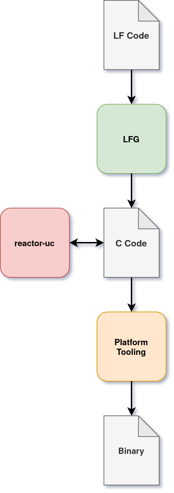

\page getting-started Getting Started

Learning a new framework and worse a framework for system design and synthesis is 
an intimidating process. This guide explains the core concepts of reactor-uc and 
is highly recommended for beginners.

\note If you are not familiar with the Lingua Franca (LF), please refer to the [handbook](https://www.lf-lang.org/docs/).

The design of systems with reactor-uc and Lingua Franca follows a top-down design 
approach, where the programmer starts with his design written in Lingua Franca. The 
LF code generator (LFG) translates your design into C code. This generated code uses 
the reactor-uc runtime functions to execute the program. When you create federated 
(distributed) programs, the LFG generates subfolders for each federate (node) in your 
system. We realize that we will never be able to provide an "apple-like" experience for
every platform. That's why the code generator also generates importable CMake and make
files that you can import into your build system. For common platforms like [Zephyr](https://zephyrproject.org/),
[Riot](https://riot-os.org) or the [PICO-sdk](https://www.raspberrypi.com/documentation/pico-sdk/) we provide build templates.

